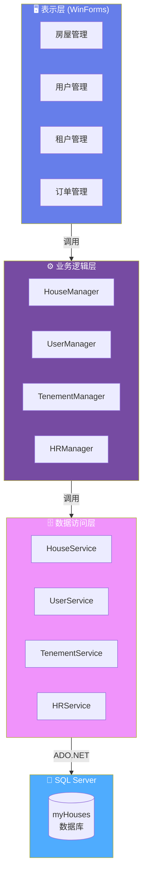

<h1 align="center">🏠 房屋租赁管理系统</h1>
<p align="center"><strong>House Rental Management System</strong></p>

<p align="center">
  
  
  
  
  
  
</p>

---

## 📖 项目简介

**房屋租赁管理系统** 是一款基于 .NET 8 开发的 Windows Forms 桌面应用程序，面向房屋租赁管理场景，提供房源、租户、订单等核心业务的完整管理解决方案。系统采用 **经典三层架构**（UI → BLL → DAL），结构清晰、便于维护。

> 💡 **适用场景**：房屋中介、物业管理公司、个人房东的租赁业务管理。

---

## ✨ 核心功能

| 模块 | 功能描述 |
|------|----------|
| 🏘️ **房屋管理** | 房源信息的添加、编辑、删除、多条件组合查询 |
| 📂 **房屋类型** | 房源分类（户型/用途/区域）的增删改查 |
| 👤 **用户管理** | 系统用户 CRUD，支持角色权限（管理员/普通用户） |
| 🧑‍🤝‍🧑 **租户管理** | 租户信息登记、编辑、查询与维护 |
| 📋 **订单管理** | 租赁订单的创建、状态跟踪与历史记录 |
| ✍️ **用户注册** | 新用户自助注册功能 |
| 💬 **反馈信息** | 用户意见反馈的提交与查看 |
| 📊 **Excel 导入导出** | 基于 NPOI 的数据批量导入导出 |

---

## 🧱 项目结构

```
房屋租赁系统/
│
├── 房屋租赁系统/                  # 🖥️ 表示层 — WinForms 用户界面
│   ├── Program.cs                 #    应用程序入口
│   ├── MainForm.cs                #    主窗体（菜单导航）
│   ├── Form_denglu.cs             #    登录界面
│   ├── 房屋管理/                   #    房源增删改查窗体
│   ├── 房屋类型管理/               #    分类管理窗体
│   ├── 用户管理/                   #    用户管理 & 注册窗体
│   ├── 租户管理/                   #    租户管理窗体
│   ├── 订单管理/                   #    订单管理窗体
│   ├── 反馈信息/                   #    反馈管理窗体
│   └── ExcelHelper.cs             #    NPOI Excel 工具类
│
├── 房屋租赁系统.BLL/               # ⚙️ 业务逻辑层
│   ├── CategoryManager.cs         #    房源分类业务
│   ├── FeedbackManager.cs         #    反馈信息业务
│   ├── HouseManager.cs            #    房源业务
│   ├── HRManager.cs               #    订单业务
│   ├── TenementManager.cs         #    租户业务
│   ├── UserManager.cs             #    用户业务
│   └── zhuceManager.cs            #    注册业务
│
├── 房屋租赁系统.DAL/               # 🗄️ 数据访问层
│   ├── sqlHelper.cs               #    ADO.NET 数据库操作封装
│   ├── CategoryService.cs         #    分类数据访问
│   ├── FeedbackService.cs         #    反馈数据访问
│   ├── HouseService.cs            #    房源数据访问
│   ├── HRService.cs               #    订单数据访问
│   ├── TenementService.cs         #    租户数据访问
│   ├── UserService.cs             #    用户数据访问
│   └── zhuceService.cs            #    注册数据访问
│
├── 房屋租赁系统.Models/            # 📦 数据模型层
│   ├── Category.cs                #    房屋分类实体
│   ├── Feedback.cs                #    反馈信息实体
│   ├── House.cs                   #    房源实体
│   ├── HR.cs                      #    订单实体
│   ├── Tenement.cs                #    租户实体
│   └── User.cs                    #    用户实体
│
└── 房屋租赁系统.sln                # 解决方案文件
```

---

## 🏗️ 架构设计



**三层职责：**

| 层级 | 项目 | 职责 |
|------|------|------|
| **表示层 (UI)** | `房屋租赁系统` | WinForms 窗体交互、数据展示、用户输入校验 |
| **业务逻辑层 (BLL)** | `房屋租赁系统.BLL` | 业务规则处理、数据转换、逻辑校验 |
| **数据访问层 (DAL)** | `房屋租赁系统.DAL` | ADO.NET + SqlHelper 封装数据库 CRUD |
| **模型层 (Models)** | `房屋租赁系统.Models` | 实体类定义，与数据库表一一映射 |

---

## 🛠️ 技术栈

| 类别 | 技术 | 说明 |
|------|------|------|
| **运行时** | .NET 8.0 | 跨平台、高性能 |
| **UI 框架** | Windows Forms | 经典桌面应用框架 |
| **语言** | C# 12 | 现代、类型安全 |
| **数据库** | SQL Server | 关系型数据库 |
| **数据访问** | ADO.NET + `SqlHelper` | 原生高效的数据操作 |
| **Excel 处理** | NPOI 2.7.4 | 无需 Office 即可读写 Excel |
| **界面美化** | IrisSkin4 | WinForms 皮肤引擎 |
| **IDE** | Visual Studio 2022 | v17.13+ |

---

## 🚀 快速开始

### 环境要求

- [.NET 8.0 SDK](https://dotnet.microsoft.com/download/dotnet/8.0)
- [Visual Studio 2022](https://visualstudio.microsoft.com/vs/) (v17.13+)
- [SQL Server](https://www.microsoft.com/sql-server) (LocalDB 或完整版)

### 配置数据库

1. 在 SQL Server 中创建数据库 `myHouses`
2. 执行数据表建表脚本（如有提供）
3. 修改连接字符串 — 文件位置：

```
房屋租赁系统.DAL/sqlHelper.cs
```

```csharp
// 按实际环境修改以下参数
private static string connStr =
    "User ID=sa;Initial Catalog=myHouses;Password=你的密码;Data Source=localhost,1433";
```

### 运行项目

```bash
# 克隆仓库
git clone git@github.com:yolushika/HouseManager.git
cd HouseManager

# 还原依赖
dotnet restore

# 编译运行
dotnet run --project 房屋租赁系统
```

或直接用 **Visual Studio 2022** 打开 `房屋租赁系统.sln`，按 `F5` 运行。

---

## 📊 数据模型

| 实体 | 说明 | 核心字段 |
|------|------|----------|
| `House` | 房源信息 | 编号、地址、面积、户型、租金、状态 |
| `Category` | 房屋分类 | 分类名称、描述 |
| `User` | 系统用户 | 用户名、密码、角色权限 |
| `Tenement` | 租户信息 | 姓名、联系方式、身份证号 |
| `HR` | 租赁订单 | 房源ID、租户ID、租期、租金、状态 |
| `Feedback` | 用户反馈 | 反馈内容、提交时间、处理状态 |

---

## 📝 注意事项

- ⚠️ 数据库连接字符串含密码，请勿将生产环境凭据提交到公开仓库
- 🔧 项目依赖 SQL Server，未安装时可用 [SQL Server LocalDB](https://learn.microsoft.com/sql/database-engine/configure-windows/sql-server-express-localdb) 替代
- 🎨 IrisSkin4 皮肤文件位于 `房屋租赁系统/IrisSkin4/` 目录
- 🧪 当前版本未包含单元测试，欢迎贡献

---

## 📄 许可证

本项目基于 **MIT License** 开源，详见 [LICENSE](LICENSE)。

---

<p align="center">
  <sub>Made with ❤️ for house rental management</sub>
</p>
